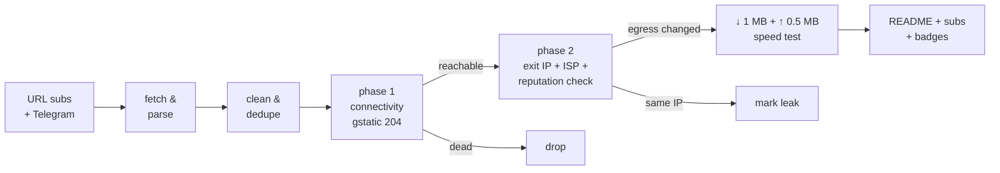

# Free Proxy Scanner

> **Really tested** free proxy aggregator. Every proxy below was fetched from public sources, tunneled through with Xray/sing-box, and verified to actually change your egress IP. No CSV-validation theater, no blind relisting.

        

## What this is

A GitHub Actions pipeline (runs daily) that fetches free proxy configs from **173 URL subscriptions** and **81 Telegram channels**, parses 9 protocols (vless / vmess / trojan / ss / hysteria2 / hysteria / tuic / socks / http), deduplicates them, and **actually connects through every single one** to separate working proxies from dead ones.

Latest run: **2026-11-28 04:16:12 UTC** — 123498 unique proxies collected from 104/104 URL sources and 8/8 Telegram channels; **4521** endpoints really tested, **1060** reachable, **1036** verified working (egress IP confirmed changed) across **42 exit countries** — **389** of them on unflagged ('clean') exit IPs and **275** on residential IPs.

## How the testing works (the *really* part)


```mermaid
flowchart LR
  S1[URL subs<br/>+ Telegram] --> F[fetch &<br/>parse]
  F --> C[clean &<br/>dedupe]
  C --> T1[phase 1<br/>connectivity<br/>gstatic 204]
  T1 -->|reachable| T2[phase 2<br/>exit IP + ISP +<br/>reputation check]
  T1 -->|dead| X[drop]
  T2 -->|egress changed| T3[↓ 1 MB + ↑ 0.5 MB<br/>speed test]
  T2 -->|same IP| X2[mark leak]
  T3 --> R[README + subs<br/>+ badges]
```

1. **Phase 1 — connectivity.** Each proxy is loaded as an outbound into a real Xray or sing-box instance (or used directly via `curl -x` for plain http/socks). An HTTPS request to `gstatic.com/generate_204` goes through the tunnel with **DNS resolved on the proxy side**. Only an HTTP 204 counts as reachable.
2. **Phase 2 — egress verification.** An ip-api request through the same tunnel must return an exit IP **different from the runner's own IP**. The same lookup also returns the exit's **country, city, ISP, AS number and IP-reputation flags** (datacenter / residential / mobile, proxy-DB listing) — all of which end up in the proxy's name. Proxies that pass phase 1 but keep your IP are marked as leaks and excluded from the working list.
3. **Throughput, both directions.** Working proxies download 1 MB from and upload 512 KB to `speed.cloudflare.com` through the tunnel; the measured down/up rates are the `↓`/`↑` numbers you see in the names and tables.
4. **Engine fallback.** If a proxy fails on Xray, it is retried on sing-box (and vice versa) before being declared dead — some configs only work on one core.

## How to read a proxy name

Every proxy in the subscription files is named so that the node list in your client already tells you **exactly what you would be connecting to** — entry and exit country, the ISP and AS operating the **verified exit IP**, measured download **and upload** speed, the exit IP itself, and the IP's reputation:

```text
#42 🇺🇸 US → 🇩🇪 DE | Contabo AS141995 | ↓12.0 ↑1.2Mbps | 84.247.155.196 | DC·Clean
  │            │        │               │               │                │
 rank   entry→exit   ISP + AS   measured ↓/↑   verified exit   IP type·reputation
```

| tag | meaning |
|-----|---------|
| `↓` / `↑` | measured download / upload throughput through the live tunnel (Mbps); `?` = test failed or skipped
| `DC` | the exit IP belongs to a datacenter / hosting network
| `RES` | residential IP (not in hosting ranges — usually the best bet for not getting blocked as a bot/VPN)
| `MOB` | mobile / carrier IP (CGNAT — often the "cleanest" class for streaming and sign-ups)
| `Clean` | exit IP is **not** listed in ip-api's proxy/VPN/Tor database
| `Flag` | exit IP **is** listed as a proxy/VPN exit — expect streaming and anti-bot blocks
| `→` | entry country → exit country; a single flag means the tunnel exits where it enters (no cross-country relay)

So `#42 🇺🇸 US → 🇩🇪 DE | Contabo AS141995 | ↓12.0 ↑1.2Mbps | 84.247.155.196 | DC·Clean` reads as: rank 42, enter in the US, exit in Germany on a Contabo datacenter address (AS141995) at 12 Mbps down / 1.2 Mbps up, and the exit is not listed in proxy databases.

## Top working proxies

All 1036 working proxies are published in [`subs/all.txt`](subs/all.txt); this table shows the top 25. The `name` column is exactly what your client will show (see [How to read a proxy name](#how-to-read-a-proxy-name)).

| # | name | proto | entry server | latency | engine |
|---|------|-------|--------------|---------|--------|
| 1 | #1 🇺🇸 US | GTHost AS63023 | ↓32.2 ↑14.8Mbps | 38.64.138.135 | RES·Flag | `vmess` | `38.64.138.135:1270` | 176 ms | xray |
| 2 | #2 🇺🇸 US | Datacamp AS60068 | ↓32.1 ↑9.2Mbps | 156.146.38.169 | DC·Flag | `ss` | `156.146.38.169:443` | 124 ms | xray |
| 3 | #3 🇺🇸 US | OPHL AS132203 | ↓30.9 ↑19.5Mbps | 49.51.39.148 | DC·Clean | `ss` | `49.51.39.148:443` | 182 ms | xray |
| 4 | #4 🇺🇸 US | Datacamp AS60068 | ↓30.3 ↑19.5Mbps | 156.146.38.168 | DC·Flag | `ss` | `156.146.38.168:443` | 159 ms | xray |
| 5 | #5 🇺🇸 US | GTHost AS63023 | ↓30.0 ↑13.6Mbps | 67.220.73.204 | DC·Flag | `vless` | `67.220.73.204:16016` | 162 ms | xray |
| 6 | #6 🇺🇸 US | GTHost AS63023 | ↓29.7 ↑17.4Mbps | 38.64.138.187 | RES·Flag | `vmess` | `38.64.138.187:1270` | 201 ms | xray |
| 7 | #7 🇺🇸 US | Multacom AS35916 | ↓29.6 ↑15.1Mbps | 148.135.86.162 | RES·Clean | `vless` | `148.135.86.162:10000` | 646 ms | xray |
| 8 | #8 🇺🇸 US | GTHost AS63023 | ↓29.1 ↑14.8Mbps | 162.251.60.97 | DC·Flag | `vmess` | `162.251.60.97:1270` | 136 ms | xray |
| 9 | #9 🇺🇸 US | DigitalOcean AS14061 | ↓28.8 ↑19.1Mbps | 137.184.89.151 | DC·Flag | `ss` | `137.184.89.151:19999` | 95 ms | xray |
| 10 | #10 🇺🇸 US | GTHost AS63023 | ↓28.6 ↑17.8Mbps | 67.220.73.178 | DC·Flag | `ss` | `67.220.73.178:19999` | 104 ms | xray |
| 11 | #11 🇺🇸 US | GTHost AS63023 | ↓28.6 ↑14.9Mbps | 38.128.66.212 | DC·Flag | `vmess` | `38.128.66.212:1270` | 127 ms | xray |
| 12 | #12 🇺🇸 US | GTHost AS63023 | ↓28.4 ↑15.7Mbps | 216.106.178.169 | RES·Flag | `ss` | `216.106.178.169:19999` | 136 ms | xray |
| 13 | #13 🇺🇸 US | GTHost AS63023 | ↓28.0 ↑17.8Mbps | 38.64.138.135 | RES·Flag | `ss` | `38.64.138.135:19999` | 123 ms | xray |
| 14 | #14 🇺🇸 US | Enzu AS18978 | ↓27.9 ↑14.2Mbps | 38.145.220.193 | RES·Clean | `vless` | `38.145.220.193:443` | 154 ms | xray |
| 15 | #15 🇺🇸 US | Datacamp AS60068 | ↓27.8 ↑19.2Mbps | 156.146.38.170 | DC·Flag | `ss` | `156.146.38.170:443` | 126 ms | xray |
| 16 | #16 🇺🇸 US | GTHost AS63023 | ↓27.2 ↑13.8Mbps | 162.251.61.46 | DC·Flag | `vmess` | `162.251.61.46:1270` | 140 ms | xray |
| 17 | #17 🇺🇸 US | GTHost AS63023 | ↓25.8 ↑20.6Mbps | 67.220.73.167 | DC·Flag | `ss` | `67.220.73.247:443` | 143 ms | xray |
| 18 | #18 🇺🇸 US | GTHost AS63023 | ↓25.3 ↑15.6Mbps | 38.128.66.241 | DC·Flag | `vmess` | `38.128.66.241:1270` | 124 ms | xray |
| 19 | #19 🇺🇸 US | OVH AS16276 | ↓25.1 ↑14.3Mbps | 15.204.97.209 | DC·Flag | `vless` | `15.204.97.209:23576` | 159 ms | xray |
| 20 | #20 🇺🇸 US | OVH AS16276 | ↓25.0 ↑14.2Mbps | 15.204.97.214 | DC·Flag | `vless` | `15.204.97.214:23576` | 145 ms | xray |
| 21 | #21 🇺🇸 US | OVH AS16276 | ↓25.0 ↑14.4Mbps | 15.204.97.198 | DC·Flag | `vless` | `15.204.97.198:23576` | 164 ms | xray |
| 22 | #22 🇺🇸 US | OVH AS16276 | ↓24.8 ↑13.8Mbps | 15.204.97.197 | DC·Flag | `vless` | `15.204.97.197:23576` | 167 ms | xray |
| 23 | #23 🇺🇸 US | OVH AS16276 | ↓24.5 ↑14.1Mbps | 15.204.97.206 | DC·Flag | `vless` | `15.204.97.206:23576` | 155 ms | xray |
| 24 | #24 🇺🇸 US | Psychz Networks AS40676 | ↓24.2 ↑17.2Mbps | 199.71.214.201 | DC·Flag | `ss` | `108.181.88.2:443` | 111 ms | xray |
| 25 | #25 🇺🇸 US | GTHost AS63023 | ↓24.2 ↑14.4Mbps | 38.128.66.249 | DC·Flag | `vmess` | `38.128.66.249:1270` | 116 ms | xray |

## Exit locations — which countries work

Every working proxy, grouped by the country of its **verified exit IP** (phase 2), with a dedicated subscription file per country. Currently 42 countries have at least one working exit.

| country | working | avg speed | best latency | share | list |
|---------|--------:|----------:|-------------:|------:|------|
| 🇺🇸 United States | 271 | 13.1 Mbps | 93 ms | 26% | [`US.txt`](subs/by-country/US.txt) |
| 🇳🇱 Netherlands | 170 | 5.2 Mbps | 374 ms | 16% | [`NL.txt`](subs/by-country/NL.txt) |
| 🇯🇵 Japan | 162 | 2.5 Mbps | 371 ms | 16% | [`JP.txt`](subs/by-country/JP.txt) |
| 🇩🇪 Germany | 85 | 4.7 Mbps | 410 ms | 8% | [`DE.txt`](subs/by-country/DE.txt) |
| 🇫🇷 France | 45 | 5.5 Mbps | 360 ms | 4% | [`FR.txt`](subs/by-country/FR.txt) |
| 🇨🇦 Canada | 35 | 7.3 Mbps | 142 ms | 3% | [`CA.txt`](subs/by-country/CA.txt) |
| 🇬🇧 United Kingdom | 33 | 5.0 Mbps | 359 ms | 3% | [`GB.txt`](subs/by-country/GB.txt) |
| 🇸🇬 Singapore | 31 | 3.5 Mbps | 558 ms | 3% | [`SG.txt`](subs/by-country/SG.txt) |
| 🇭🇰 Hong Kong | 23 | 3.0 Mbps | 115 ms | 2% | [`HK.txt`](subs/by-country/HK.txt) |
| 🇮🇱 Israel | 21 | 3.4 Mbps | 518 ms | 2% | [`IL.txt`](subs/by-country/IL.txt) |
| 🇸🇪 Sweden | 19 | 5.0 Mbps | 451 ms | 2% | [`SE.txt`](subs/by-country/SE.txt) |
| 🇰🇷 South Korea | 17 | 3.8 Mbps | 534 ms | 2% | [`KR.txt`](subs/by-country/KR.txt) |
| 🇮🇹 Italy | 15 | 6.1 Mbps | 434 ms | 1% | [`IT.txt`](subs/by-country/IT.txt) |
| 🇨🇭 Switzerland | 12 | 5.2 Mbps | 455 ms | 1% | [`CH.txt`](subs/by-country/CH.txt) |
| 🇪🇸 Spain | 10 | 2.3 Mbps | 631 ms | 1% | [`ES.txt`](subs/by-country/ES.txt) |
| 🇫🇮 Finland | 10 | 3.7 Mbps | 630 ms | 1% | [`FI.txt`](subs/by-country/FI.txt) |
| 🇷🇺 Russia | 10 | 4.0 Mbps | 693 ms | 1% | [`RU.txt`](subs/by-country/RU.txt) |
| 🇧🇾 BY | 6 | 4.2 Mbps | 763 ms | 1% | [`BY.txt`](subs/by-country/BY.txt) |
| 🇮🇳 India | 6 | 1.7 Mbps | 936 ms | 1% | [`IN.txt`](subs/by-country/IN.txt) |
| 🇦🇹 Austria | 5 | 3.3 Mbps | 476 ms | 0% | [`AT.txt`](subs/by-country/AT.txt) |
| 🇹🇼 Taiwan | 5 | 3.9 Mbps | 628 ms | 0% | [`TW.txt`](subs/by-country/TW.txt) |
| 🇰🇿 Kazakhstan | 5 | 2.6 Mbps | 1160 ms | 0% | [`KZ.txt`](subs/by-country/KZ.txt) |
| 🇵🇱 Poland | 4 | 6.1 Mbps | 584 ms | 0% | [`PL.txt`](subs/by-country/PL.txt) |
| 🇧🇷 Brazil | 4 | 5.3 Mbps | 695 ms | 0% | [`BR.txt`](subs/by-country/BR.txt) |
| 🇨🇿 Czechia | 3 | 3.8 Mbps | 627 ms | 0% | [`CZ.txt`](subs/by-country/CZ.txt) |
| 🇿🇦 South Africa | 3 | 3.5 Mbps | 970 ms | 0% | [`ZA.txt`](subs/by-country/ZA.txt) |
| 🇻🇳 Vietnam | 3 | 1.2 Mbps | 1257 ms | 0% | [`VN.txt`](subs/by-country/VN.txt) |
| 🇱🇻 Latvia | 2 | 5.1 Mbps | 647 ms | 0% | [`LV.txt`](subs/by-country/LV.txt) |
| 🇦🇺 Australia | 2 | 5.1 Mbps | 759 ms | 0% | [`AU.txt`](subs/by-country/AU.txt) |
| 🇹🇭 Thailand | 2 | 3.8 Mbps | 902 ms | 0% | [`TH.txt`](subs/by-country/TH.txt) |
| 🇮🇷 Iran | 2 | 3.3 Mbps | 689 ms | 0% | [`IR.txt`](subs/by-country/IR.txt) |
| 🇱🇰 LK | 2 | 3.6 Mbps | 1021 ms | 0% | [`LK.txt`](subs/by-country/LK.txt) |
| 🇬🇷 Greece | 2 | 2.8 Mbps | 2380 ms | 0% | [`GR.txt`](subs/by-country/GR.txt) |
| 🇷🇴 Romania | 2 | 2.4 Mbps | 716 ms | 0% | [`RO.txt`](subs/by-country/RO.txt) |
| 🇮🇪 Ireland | 2 | 1.3 Mbps | 332 ms | 0% | [`IE.txt`](subs/by-country/IE.txt) |
| 🇧🇬 Bulgaria | 1 | 5.1 Mbps | 735 ms | 0% | [`BG.txt`](subs/by-country/BG.txt) |
| 🇹🇷 Turkey | 1 | 3.3 Mbps | 1097 ms | 0% | [`TR.txt`](subs/by-country/TR.txt) |
| 🇪🇪 Estonia | 1 | 2.8 Mbps | 606 ms | 0% | [`EE.txt`](subs/by-country/EE.txt) |
| 🇦🇪 UAE | 1 | 0.9 Mbps | 1091 ms | 0% | [`AE.txt`](subs/by-country/AE.txt) |
| 🇳🇴 Norway | 1 | 0.8 Mbps | 1810 ms | 0% | [`NO.txt`](subs/by-country/NO.txt) |
| 🇦🇱 AL | 1 | - | 722 ms | 0% | [`AL.txt`](subs/by-country/AL.txt) |
| 🇲🇾 Malaysia | 1 | - | 2577 ms | 0% | [`MY.txt`](subs/by-country/MY.txt) |

A `??` exit means the geo lookup could not resolve the exit IP. Base64 variants of every country file sit next to them as `<CC>.base64.txt`.

## Protocol distribution

| protocol | tested | alive | working | alive rate |
|----------|-------:|------:|--------:|-----------:|
| `vless` | 2617 | 517 | 500 | 20% |
| `ss` | 603 | 336 | 332 | 56% |
| `vmess` | 1110 | 159 | 156 | 14% |
| `hysteria2` | 60 | 43 | 43 | 72% |
| `trojan` | 127 | 3 | 3 | 2% |
| `socks` | 2 | 2 | 2 | 100% |
| `http` | 2 | 0 | 0 | 0% |

Per-protocol working lists: [`subs/by-proto/`](subs/by-proto/) (one `vless.txt`, `vmess.txt`, ... per protocol, plus `.base64.txt` variants).

## Engine breakdown

Which core verified each working proxy. The engine fallback means a proxy that failed on its primary core got a second chance on the other one.

| engine | working | note |
|--------|--------:|------|
| Xray-core | 912 | [`allxray.txt`](subs/by-engine/allxray.txt) |
| sing-box | 122 | [`allsingbox.txt`](subs/by-engine/allsingbox.txt) |
| direct (curl) | 2 | plain http/socks, [`alldirect.txt`](subs/by-engine/alldirect.txt) |

## Speed & latency profile

| speed tier | proxies |
|-----------|--------:|
| >= 5 Mbps | 469 |
| 1 - 5 Mbps | 292 |
| 0.25 - 1 Mbps | 69 |
| < 0.25 Mbps | 0 |
| unmeasured | 206 |

Latency (phase-1 HTTPS round trip): median **627 ms**, p90 **3410 ms**. 24 proxies passed connectivity but failed egress verification (leaked the runner IP or broke on the exit check) and are excluded.

## Source health

112 active, 142 auto-retired (10 fetch failures / 10 all-dead runs / 10 days without anything new). Best contributors this run:

| source | kind | tested | alive | new this run |
|--------|------|-------:|------:|-------------:|
| `EV` | url | 796 | 709 | 3126 |
| `SK` | url | 975 | 654 | 5018 |
| `NK` | url | 893 | 573 | 0 |
| `EV-VL` | url | 373 | 313 | 0 |
| `F0` | url | 317 | 305 | 14 |
| `RD-SS` | url | 526 | 293 | 575 |
| `Ni` | url | 349 | 269 | 19 |
| `EV-SS` | url | 280 | 260 | 26 |
| `AN` | url | 251 | 246 | 12 |
| `AG-PL` | url | 449 | 226 | 762 |
| `HC` | url | 1152 | 210 | 240 |
| `RD-VL` | url | 2132 | 208 | 3111 |
| `HP` | url | 229 | 200 | 22 |
| `ST-VL` | url | 2111 | 156 | 493 |
| `LA` | url | 780 | 146 | 13980 |
| `KA` | url | 2814 | 124 | 8234 |
| `RD-VM` | url | 564 | 121 | 3983 |
| `EV-VM` | url | 122 | 118 | 0 |
| `SW` | url | 102 | 96 | 13 |
| `ST-VM` | url | 554 | 89 | 47 |

## History

working per run (last 30): █▇▆▆▆▆▆█▆▆▇█████████████▇▇█▇██

| date (UTC) | tested | alive | working | avg ↓ | max ↓ | avg ↑ | clean |
|------------|-------:|------:|--------:|----:|----:|----:|------:|
| 2026-11-28 05:04 | 4521 | 1060 | 1036 | 7.0M | 32.2M | 4.3M | 389 |
| 2026-11-27 05:07 | 4521 | 1181 | 1147 | 7.6M | 72.8M | 4.9M | 412 |
| 2026-11-26 05:02 | 4523 | 1027 | 968 | 10.5M | 141.6M | 7.4M | 295 |
| 2026-11-25 05:08 | 4511 | 1108 | 1053 | 6.5M | 76.6M | 4.0M | 341 |
| 2026-11-24 15:17 | 4518 | 1039 | 979 | 6.4M | 60.1M | 4.1M | 310 |
| 2026-11-24 03:38 | 4517 | 1065 | 1017 | 10.5M | 138.1M | - | - |
| 2026-11-22 03:38 | 4516 | 1213 | 1159 | 10.1M | 139.3M | - | - |
| 2026-11-21 03:33 | 4514 | 1155 | 1120 | 11.2M | 128.3M | - | - |
| 2026-11-20 03:37 | 4517 | 1203 | 1171 | 8.6M | 61.0M | - | - |
| 2026-11-19 03:39 | 4520 | 1168 | 1134 | 10.2M | 73.9M | - | - |
| 2026-11-17 03:38 | 4521 | 1198 | 1174 | 10.0M | 83.1M | - | - |
| 2026-11-16 03:41 | 4523 | 1137 | 1100 | 10.3M | 83.4M | - | - |
| 2026-11-14 03:41 | 4514 | 1104 | 1067 | 10.7M | 135.5M | - | - |
| 2026-11-13 03:31 | 4507 | 1150 | 1119 | 9.4M | 56.3M | - | - |
| 2026-11-12 03:35 | 4512 | 1209 | 1166 | 7.0M | 73.5M | - | - |

## Subscription files

Everything under [`subs/`](subs/) is regenerated every run. Plain lists are one proxy URI per line; `.base64.txt` variants are the same list base64-encoded for clients that need the classic sub format.

| file | contents | direct subscription URL |
|------|----------|--------------------------|
| [`all.txt`](subs/all.txt) | ALL working proxies, ranked by speed (1036) | `https://raw.githubusercontent.com/onlyactions/proxy-scanner/main/subs/all.txt` |
| [`all.base64.txt`](subs/all.base64.txt) | same, base64 | `https://raw.githubusercontent.com/onlyactions/proxy-scanner/main/subs/all.base64.txt` |
| [`top150.txt`](subs/top150.txt) | top 150 ranked (150) | `https://raw.githubusercontent.com/onlyactions/proxy-scanner/main/subs/top150.txt` |
| [`top150.base64.txt`](subs/top150.base64.txt) | same, base64 | `https://raw.githubusercontent.com/onlyactions/proxy-scanner/main/subs/top150.base64.txt` |
| [`by-proto/`](subs/by-proto/) | one list per protocol (6 protocols) | ...`/subs/by-proto/<proto>.txt` |
| [`by-engine/allxray.txt`](subs/by-engine/allxray.txt) | verified on Xray (912) | `https://raw.githubusercontent.com/onlyactions/proxy-scanner/main/subs/by-engine/allxray.txt` |
| [`by-engine/allsingbox.txt`](subs/by-engine/allsingbox.txt) | verified on sing-box (122) | `https://raw.githubusercontent.com/onlyactions/proxy-scanner/main/subs/by-engine/allsingbox.txt` |
| [`by-country/`](subs/by-country/) | one list per exit country (42 countries, e.g. [`US.txt`](subs/by-country/US.txt), [`DE.txt`](subs/by-country/DE.txt)) | ...`/subs/by-country/<CC>.txt` |
| [`sing-box-client.json`](subs/sing-box-client.json) | top 150 as a ready-to-run sing-box client config | `https://raw.githubusercontent.com/onlyactions/proxy-scanner/main/subs/sing-box-client.json` |
| [`xray-client.json`](subs/xray-client.json) | top 150 as a ready-to-run xray client config | `https://raw.githubusercontent.com/onlyactions/proxy-scanner/main/subs/xray-client.json` |
| [`archive/`](archive/) | gz snapshot of every collection (30 kept) | — |

## Use the proxies

- **v2rayN / v2rayNG / Nekobox / Hiddify / Shadowrocket**: add subscription `https://raw.githubusercontent.com/onlyactions/proxy-scanner/main/subs/all.base64.txt` (everything working) or `https://raw.githubusercontent.com/onlyactions/proxy-scanner/main/subs/top150.base64.txt` (curated top 150).
- **Want a specific country?** Grab `subs/by-country/<CC>.txt` (see the Exit locations table above) — e.g. `https://raw.githubusercontent.com/onlyactions/proxy-scanner/main/subs/by-country/US.txt`, `https://raw.githubusercontent.com/onlyactions/proxy-scanner/main/subs/by-country/DE.txt`.
- **Only one protocol?** `subs/by-proto/<proto>.txt` — e.g. `https://raw.githubusercontent.com/onlyactions/proxy-scanner/main/subs/by-proto/vless.txt`, `https://raw.githubusercontent.com/onlyactions/proxy-scanner/main/subs/by-proto/hysteria2.txt`.
- **sing-box**: download [`subs/sing-box-client.json`](subs/sing-box-client.json) and run `sing-box run -c sing-box-client.json` — it listens on `127.0.0.1:2080` (mixed) with a selector + auto urltest group.
- **Xray**: download [`subs/xray-client.json`](subs/xray-client.json), socks inbound on `127.0.0.1:2080`.
- Raw snapshots of every collection: [`archive/`](archive/) (30 kept).

## Repository layout

```
sources/            url_subs.yml + telegram.yml (scannable source lists)
scripts/            collect.py, test.py, report.py + lib/
state/              source health, alive-recall pool, geo cache (committed)
data/               stats, history, compact last-run results
subs/               THE PRODUCT: verified working proxies, split by
                    proto / engine / exit country + all + top150 lists
badges/             shields.io endpoint badges
archive/            gz snapshots of every collection
```

## Why most "free proxy lists" lie

The typical aggregator relists whatever it scraped, so 80-95% of entries are dead within hours — this run found **77% unreachable** and **77% unusable** overall. Only tunnels that completed a real HTTPS handshake, returned a verifiable foreign exit IP, and moved a 1 MB download **and** a 512 KB upload through the tunnel are counted as working here.

## Disclaimers

- Free proxies are **public and untrusted**. Anything you send through them can be observed or modified by their operators. Never use them for authentication, payments, or anything sensitive.
- All configs are collected from publicly posted sources (GitHub subscriptions and public Telegram channels); no credentials are guessed or brute-forced. Removal requests: open an issue.
- Availability is transient: the working list is re-verified daily, and past performance never guarantees future availability.

