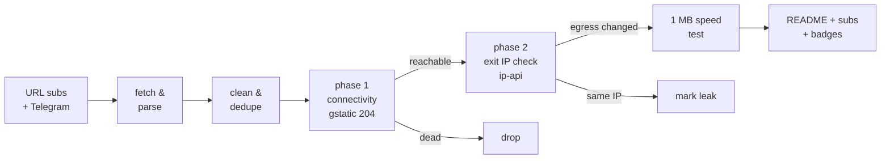

# Free Proxy Scanner

> **Really tested** free proxy aggregator. Every proxy below was fetched from public sources, tunneled through with Xray/sing-box, and verified to actually change your egress IP. No CSV-validation theater, no blind relisting.

      

## What this is

A GitHub Actions pipeline (runs once a day) that fetches free proxy configs from **173 URL subscriptions** and **81 Telegram channels**, parses 9 protocols (vless / vmess / trojan / ss / hysteria2 / hysteria / tuic / socks / http), deduplicates them, and **actually connects through every single one** to separate working proxies from dead ones.

Latest run: **2026-11-21 02:54:44 UTC** — 124628 unique proxies collected from 106/106 URL sources and 9/9 Telegram channels; **4514** endpoints really tested, **1155** reachable, **1120** verified working (egress IP confirmed changed) across **48 exit countries**.

## How the testing works (the *really* part)


```mermaid
flowchart LR
  S1[URL subs<br/>+ Telegram] --> F[fetch &<br/>parse]
  F --> C[clean &<br/>dedupe]
  C --> T1[phase 1<br/>connectivity<br/>gstatic 204]
  T1 -->|reachable| T2[phase 2<br/>exit IP check<br/>ip-api]
  T1 -->|dead| X[drop]
  T2 -->|egress changed| T3[1 MB speed<br/>test]
  T2 -->|same IP| X2[mark leak]
  T3 --> R[README + subs<br/>+ badges]
```

1. **Phase 1 — connectivity.** Each proxy is loaded as an outbound into a real Xray or sing-box instance (or used directly via `curl -x` for plain http/socks). An HTTPS request to `gstatic.com/generate_204` goes through the tunnel with **DNS resolved on the proxy side**. Only an HTTP 204 counts as reachable.
2. **Phase 2 — egress verification.** An ip-api request through the same tunnel must return an exit IP **different from the runner's own IP**, plus its country and AS. Proxies that pass phase 1 but keep your IP are marked as leaks and excluded from the working list. Server country vs exit country mismatches are flagged in the tables.
3. **Throughput.** Working proxies download 1 MB from `speed.cloudflare.com` through the tunnel; the measured rate is the speed you see in the tables.
4. **Engine fallback.** If a proxy fails on Xray, it is retried on sing-box (and vice versa) before being declared dead — some configs only work on one core.

## Top working proxies

All 1120 working proxies are published in [`subs/all.txt`](subs/all.txt); this table shows the top 25.

| # | proxy | proto | server | exit | latency | speed | engine |
|---|-------|-------|--------|------|---------|-------|--------|
| 1 | #1 ❓ ?? → 🇺🇸 US | `trojan` | `66.163.122.113:443` | United States | 154 ms | 128.3 Mbps | xray |
| 2 | #2 ❓ ?? → 🇺🇸 US | `trojan` | `66.163.122.26:443` | United States | 70 ms | 128.1 Mbps | xray |
| 3 | #3 ❓ ?? → 🇺🇸 US | `ss` | `40.160.86.43:8388` | United States | 91 ms | 123.3 Mbps | xray |
| 4 | #4 ❓ ?? → 🇺🇸 US | `trojan` | `66.163.122.25:443` | United States | 138 ms | 120.9 Mbps | xray |
| 5 | #5 ❓ ?? → 🇺🇸 US | `trojan` | `66.163.122.7:443` | United States | 69 ms | 109.9 Mbps | xray |
| 6 | #6 ❓ ?? → 🇺🇸 US | `ss` | `185.230.230.18:19999` | United States | 66 ms | 108.2 Mbps | xray |
| 7 | #7 ❓ ?? → 🇺🇸 US | `vmess` | `67.220.95.49:1270` | United States | 120 ms | 102.3 Mbps | xray |
| 8 | #8 ❓ ?? → 🇺🇸 US | `ss` | `135.148.42.13:8388` | United States | 78 ms | 97.9 Mbps | xray |
| 9 | #9 ❓ ?? → 🇺🇸 US | `ss` | `172.111.38.72:19999` | United States | 58 ms | 93.8 Mbps | xray |
| 10 | #10 ❓ ?? → 🇺🇸 US | `trojan` | `66.163.122.81:443` | United States | 65 ms | 93.2 Mbps | xray |
| 11 | #11 ❓ ?? → 🇺🇸 US | `vmess` | `38.107.226.5:1270` | United States | 129 ms | 91.5 Mbps | xray |
| 12 | #12 ❓ ?? → 🇺🇸 US | `ss` | `45.86.51.18:19999` | United States | 56 ms | 83.0 Mbps | xray |
| 13 | #13 🇺🇸 US → 🇦🇺 AU | `vmess` | `67.220.95.3:18000` | Australia | 101 ms | 81.8 Mbps | xray |
| 14 | #14 🇺🇸 US → 🇺🇸 US | `vless` | `159.89.87.21:28190` | United States | 94 ms | 76.2 Mbps | xray |
| 15 | #15 ❓ ?? → 🇺🇸 US | `hysteria2` | `206.189.229.48:443` | United States | 53 ms | 69.5 Mbps | singbox |
| 16 | #16 ❓ ?? → 🇺🇸 US | `trojan` | `66.163.122.30:443` | United States | 57 ms | 68.1 Mbps | xray |
| 17 | #17 🇺🇸 US → 🇺🇸 US | `ss` | `37.19.198.243:443` | United States | 71 ms | 67.9 Mbps | xray |
| 18 | #18 ❓ ?? → 🇺🇸 US | `vless` | `45.138.100.248:10443` | United States | 57 ms | 66.5 Mbps | singbox |
| 19 | #19 🇺🇸 US → 🇺🇸 US | `ss` | `37.19.198.244:443` | United States | 36 ms | 62.8 Mbps | xray |
| 20 | #20 ❓ ?? → 🇺🇸 US | `ss` | `138.197.89.234:28960` | United States | 38 ms | 57.7 Mbps | xray |
| 21 | #21 🇺🇸 US → 🇺🇸 US | `ss` | `37.19.198.160:443` | United States | 57 ms | 55.3 Mbps | xray |
| 22 | #22 🇺🇸 US → 🇺🇸 US | `vless` | `169.40.42.74:443` | United States | 197 ms | 55.2 Mbps | xray |
| 23 | #23 🇺🇸 US → 🇺🇸 US | `vless` | `169.40.42.168:443` | United States | 3398 ms | 54.1 Mbps | xray |
| 24 | #24 🇺🇸 US → 🇺🇸 US | `vless` | `169.40.42.163:443` | United States | 175 ms | 52.8 Mbps | xray |
| 25 | #25 ❓ ?? → 🇺🇸 US | `ss` | `200.102.179.179:8388` | United States | 54 ms | 47.7 Mbps | xray |

## Exit locations — which countries work

Every working proxy, grouped by the country of its **verified exit IP** (phase 2), with a dedicated subscription file per country. Currently 48 countries have at least one working exit.

| country | working | avg speed | best latency | share | list |
|---------|--------:|----------:|-------------:|------:|------|
| 🇺🇸 United States | 329 | 20.9 Mbps | 36 ms | 29% | [`US.txt`](subs/by-country/US.txt) |
| 🇳🇱 Netherlands | 174 | 7.5 Mbps | 247 ms | 16% | [`NL.txt`](subs/by-country/NL.txt) |
| 🇩🇪 Germany | 150 | 6.0 Mbps | 270 ms | 13% | [`DE.txt`](subs/by-country/DE.txt) |
| 🇯🇵 Japan | 83 | 2.7 Mbps | 529 ms | 7% | [`JP.txt`](subs/by-country/JP.txt) |
| 🇨🇦 Canada | 47 | 14.6 Mbps | 76 ms | 4% | [`CA.txt`](subs/by-country/CA.txt) |
| 🇫🇷 France | 40 | 7.1 Mbps | 278 ms | 4% | [`FR.txt`](subs/by-country/FR.txt) |
| 🇸🇬 Singapore | 32 | 2.7 Mbps | 693 ms | 3% | [`SG.txt`](subs/by-country/SG.txt) |
| 🇪🇸 Spain | 28 | 5.3 Mbps | 281 ms | 2% | [`ES.txt`](subs/by-country/ES.txt) |
| 🇫🇮 Finland | 27 | 3.0 Mbps | 443 ms | 2% | [`FI.txt`](subs/by-country/FI.txt) |
| 🇬🇧 United Kingdom | 24 | 8.1 Mbps | 263 ms | 2% | [`GB.txt`](subs/by-country/GB.txt) |
| 🇨🇭 Switzerland | 17 | 6.4 Mbps | 340 ms | 2% | [`CH.txt`](subs/by-country/CH.txt) |
| 🇭🇰 Hong Kong | 16 | 3.3 Mbps | 199 ms | 1% | [`HK.txt`](subs/by-country/HK.txt) |
| 🇮🇹 Italy | 16 | 8.1 Mbps | 311 ms | 1% | [`IT.txt`](subs/by-country/IT.txt) |
| 🇦🇺 Australia | 15 | 17.3 Mbps | 80 ms | 1% | [`AU.txt`](subs/by-country/AU.txt) |
| 🇸🇪 Sweden | 15 | 5.5 Mbps | 348 ms | 1% | [`SE.txt`](subs/by-country/SE.txt) |
| 🇷🇺 Russia | 12 | 5.8 Mbps | 395 ms | 1% | [`RU.txt`](subs/by-country/RU.txt) |
| 🇵🇱 Poland | 11 | 4.2 Mbps | 492 ms | 1% | [`PL.txt`](subs/by-country/PL.txt) |
| 🇧🇾 BY | 9 | 7.0 Mbps | 463 ms | 1% | [`BY.txt`](subs/by-country/BY.txt) |
| 🇰🇷 South Korea | 9 | 3.6 Mbps | 678 ms | 1% | [`KR.txt`](subs/by-country/KR.txt) |
| 🇹🇼 Taiwan | 7 | 2.9 Mbps | 735 ms | 1% | [`TW.txt`](subs/by-country/TW.txt) |
| 🇰🇿 Kazakhstan | 5 | 3.9 Mbps | 1032 ms | 0% | [`KZ.txt`](subs/by-country/KZ.txt) |
| 🇮🇳 India | 5 | 2.6 Mbps | 830 ms | 0% | [`IN.txt`](subs/by-country/IN.txt) |
| 🇧🇷 Brazil | 4 | 6.5 Mbps | 548 ms | 0% | [`BR.txt`](subs/by-country/BR.txt) |
| 🇹🇷 Turkey | 4 | 4.5 Mbps | 494 ms | 0% | [`TR.txt`](subs/by-country/TR.txt) |
| 🇻🇳 Vietnam | 4 | 2.3 Mbps | 1288 ms | 0% | [`VN.txt`](subs/by-country/VN.txt) |
| 🇦🇹 Austria | 3 | 7.7 Mbps | 359 ms | 0% | [`AT.txt`](subs/by-country/AT.txt) |
| 🇿🇦 South Africa | 3 | 3.5 Mbps | 822 ms | 0% | [`ZA.txt`](subs/by-country/ZA.txt) |
| 🇳🇬 NG | 3 | - | 1816 ms | 0% | [`NG.txt`](subs/by-country/NG.txt) |
| 🇮🇷 Iran | 2 | 7.3 Mbps | 385 ms | 0% | [`IR.txt`](subs/by-country/IR.txt) |
| 🇦🇱 AL | 2 | 8.0 Mbps | 491 ms | 0% | [`AL.txt`](subs/by-country/AL.txt) |
| 🇨🇿 Czechia | 2 | 6.6 Mbps | 502 ms | 0% | [`CZ.txt`](subs/by-country/CZ.txt) |
| 🇱🇻 Latvia | 2 | 7.0 Mbps | 559 ms | 0% | [`LV.txt`](subs/by-country/LV.txt) |
| 🇱🇹 Lithuania | 2 | 6.8 Mbps | 660 ms | 0% | [`LT.txt`](subs/by-country/LT.txt) |
| 🇺🇦 Ukraine | 2 | 4.7 Mbps | 997 ms | 0% | [`UA.txt`](subs/by-country/UA.txt) |
| 🇪🇪 Estonia | 2 | 4.7 Mbps | 443 ms | 0% | [`EE.txt`](subs/by-country/EE.txt) |
| 🇦🇪 UAE | 2 | - | 1028 ms | 0% | [`AE.txt`](subs/by-country/AE.txt) |
| 🇮🇪 Ireland | 1 | 13.0 Mbps | 1653 ms | 0% | [`IE.txt`](subs/by-country/IE.txt) |
| 🇳🇴 Norway | 1 | 8.0 Mbps | 5160 ms | 0% | [`NO.txt`](subs/by-country/NO.txt) |
| 🇨🇾 Cyprus | 1 | 6.8 Mbps | 540 ms | 0% | [`CY.txt`](subs/by-country/CY.txt) |
| 🇷🇴 Romania | 1 | 6.4 Mbps | 586 ms | 0% | [`RO.txt`](subs/by-country/RO.txt) |
| 🇧🇬 Bulgaria | 1 | 6.3 Mbps | 593 ms | 0% | [`BG.txt`](subs/by-country/BG.txt) |
| 🇵🇦 PA | 1 | 5.0 Mbps | 4270 ms | 0% | [`PA.txt`](subs/by-country/PA.txt) |
| 🇨🇱 Chile | 1 | 5.0 Mbps | 567 ms | 0% | [`CL.txt`](subs/by-country/CL.txt) |
| 🇲🇾 Malaysia | 1 | 3.7 Mbps | 1021 ms | 0% | [`MY.txt`](subs/by-country/MY.txt) |
| 🇹🇭 Thailand | 1 | 2.8 Mbps | 5660 ms | 0% | [`TH.txt`](subs/by-country/TH.txt) |
| 🇷🇸 Serbia | 1 | 2.6 Mbps | 705 ms | 0% | [`RS.txt`](subs/by-country/RS.txt) |
| 🇨🇳 China | 1 | 2.6 Mbps | 2753 ms | 0% | [`CN.txt`](subs/by-country/CN.txt) |
| 🇬🇷 Greece | 1 | - | 5827 ms | 0% | [`GR.txt`](subs/by-country/GR.txt) |

A `??` exit means the geo lookup could not resolve the exit IP. Base64 variants of every country file sit next to them as `<CC>.base64.txt`.

## Protocol distribution

| protocol | tested | alive | working | alive rate |
|----------|-------:|------:|--------:|-----------:|
| `vless` | 2744 | 560 | 538 | 20% |
| `ss` | 571 | 276 | 270 | 48% |
| `vmess` | 989 | 159 | 153 | 16% |
| `trojan` | 150 | 116 | 116 | 77% |
| `hysteria2` | 56 | 42 | 41 | 75% |
| `socks` | 2 | 2 | 2 | 100% |
| `http` | 2 | 0 | 0 | 0% |

Per-protocol working lists: [`subs/by-proto/`](subs/by-proto/) (one `vless.txt`, `vmess.txt`, ... per protocol, plus `.base64.txt` variants).

## Engine breakdown

Which core verified each working proxy. The engine fallback means a proxy that failed on its primary core got a second chance on the other one.

| engine | working | note |
|--------|--------:|------|
| Xray-core | 971 | [`allxray.txt`](subs/by-engine/allxray.txt) |
| sing-box | 147 | [`allsingbox.txt`](subs/by-engine/allsingbox.txt) |
| direct (curl) | 2 | plain http/socks, [`alldirect.txt`](subs/by-engine/alldirect.txt) |

## Speed & latency profile

| speed tier | proxies |
|-----------|--------:|
| >= 5 Mbps | 644 |
| 1 - 5 Mbps | 287 |
| 0.25 - 1 Mbps | 48 |
| < 0.25 Mbps | 0 |
| unmeasured | 141 |

Latency (phase-1 HTTPS round trip): median **447 ms**, p90 **3643 ms**. 35 proxies passed connectivity but failed egress verification (leaked the runner IP or broke on the exit check) and are excluded.

## Source health

115 active, 139 auto-retired (10 fetch failures / 10 all-dead runs / 10 days without anything new). Best contributors this run:

| source | kind | tested | alive | new this run |
|--------|------|-------:|------:|-------------:|
| `NK` | url | 1113 | 699 | 5966 |
| `SK` | url | 1072 | 663 | 0 |
| `EV` | url | 665 | 550 | 54 |
| `HP` | url | 565 | 502 | 101 |
| `ET` | url | 454 | 346 | 2011 |
| `AG-PL` | url | 457 | 315 | 807 |
| `RD-VL` | url | 2327 | 309 | 3611 |
| `RD-SS` | url | 510 | 269 | 415 |
| `HC` | url | 1185 | 263 | 276 |
| `F0` | url | 262 | 249 | 40 |
| `EV-SS` | url | 268 | 231 | 163 |
| `EV-VL` | url | 272 | 213 | 589 |
| `ST-VL` | url | 2164 | 179 | 661 |
| `RD-VM` | url | 572 | 136 | 3913 |
| `KA` | url | 2754 | 135 | 5872 |
| `LA` | url | 682 | 124 | 14724 |
| `ST-VM` | url | 569 | 118 | 42 |
| `Ni` | url | 177 | 113 | 79 |
| `F18` | url | 145 | 101 | 232 |
| `SB-VL` | url | 1993 | 98 | 2 |

## History

working per run (last 30): ▆▆▆▇▆▆▆█▇▆▆▆▆▆█▆▆▇████████████

| date (UTC) | tested | alive | working | avg | max |
|------------|-------:|------:|--------:|----:|----:|
| 2026-11-21 03:33 | 4514 | 1155 | 1120 | 11.2M | 128.3M |
| 2026-11-20 03:37 | 4517 | 1203 | 1171 | 8.6M | 61.0M |
| 2026-11-19 03:39 | 4520 | 1168 | 1134 | 10.2M | 73.9M |
| 2026-11-17 03:38 | 4521 | 1198 | 1174 | 10.0M | 83.1M |
| 2026-11-16 03:41 | 4523 | 1137 | 1100 | 10.3M | 83.4M |
| 2026-11-14 03:41 | 4514 | 1104 | 1067 | 10.7M | 135.5M |
| 2026-11-13 03:31 | 4507 | 1150 | 1119 | 9.4M | 56.3M |
| 2026-11-12 03:35 | 4512 | 1209 | 1166 | 7.0M | 73.5M |
| 2026-11-11 03:35 | 4521 | 1141 | 1102 | 10.1M | 108.1M |
| 2026-11-10 03:31 | 4511 | 1098 | 1052 | 8.2M | 76.8M |
| 2026-11-09 03:34 | 4509 | 1081 | 1046 | 7.6M | 96.5M |
| 2026-11-08 03:39 | 4502 | 1098 | 1068 | 7.7M | 107.7M |
| 2026-11-07 03:34 | 4503 | 1040 | 994 | 7.6M | 82.2M |
| 2026-11-06 10:53 | 4846 | 900 | 837 | 8.5M | 49.1M |
| 2026-10-03 11:04 | 4500 | 899 | 860 | 8.7M | 82.3M |

## Subscription files

Everything under [`subs/`](subs/) is regenerated every run. Plain lists are one proxy URI per line; `.base64.txt` variants are the same list base64-encoded for clients that need the classic sub format.

| file | contents | direct subscription URL |
|------|----------|--------------------------|
| [`all.txt`](subs/all.txt) | ALL working proxies, ranked by speed (1120) | `https://raw.githubusercontent.com/onlyactions/proxy-scanner/main/subs/all.txt` |
| [`all.base64.txt`](subs/all.base64.txt) | same, base64 | `https://raw.githubusercontent.com/onlyactions/proxy-scanner/main/subs/all.base64.txt` |
| [`top150.txt`](subs/top150.txt) | top 150 ranked (150) | `https://raw.githubusercontent.com/onlyactions/proxy-scanner/main/subs/top150.txt` |
| [`top150.base64.txt`](subs/top150.base64.txt) | same, base64 | `https://raw.githubusercontent.com/onlyactions/proxy-scanner/main/subs/top150.base64.txt` |
| [`by-proto/`](subs/by-proto/) | one list per protocol (6 protocols) | ...`/subs/by-proto/<proto>.txt` |
| [`by-engine/allxray.txt`](subs/by-engine/allxray.txt) | verified on Xray (971) | `https://raw.githubusercontent.com/onlyactions/proxy-scanner/main/subs/by-engine/allxray.txt` |
| [`by-engine/allsingbox.txt`](subs/by-engine/allsingbox.txt) | verified on sing-box (147) | `https://raw.githubusercontent.com/onlyactions/proxy-scanner/main/subs/by-engine/allsingbox.txt` |
| [`by-country/`](subs/by-country/) | one list per exit country (48 countries, e.g. [`US.txt`](subs/by-country/US.txt), [`DE.txt`](subs/by-country/DE.txt)) | ...`/subs/by-country/<CC>.txt` |
| [`sing-box-client.json`](subs/sing-box-client.json) | top 150 as a ready-to-run sing-box client config | `https://raw.githubusercontent.com/onlyactions/proxy-scanner/main/subs/sing-box-client.json` |
| [`xray-client.json`](subs/xray-client.json) | top 150 as a ready-to-run xray client config | `https://raw.githubusercontent.com/onlyactions/proxy-scanner/main/subs/xray-client.json` |
| [`archive/`](archive/) | gz snapshot of every collection (30 kept) | — |

## Use the proxies

- **v2rayN / v2rayNG / Nekobox / Hiddify / Shadowrocket**: add subscription `https://raw.githubusercontent.com/onlyactions/proxy-scanner/main/subs/all.base64.txt` (everything working) or `https://raw.githubusercontent.com/onlyactions/proxy-scanner/main/subs/top150.base64.txt` (curated top 150).
- **Want a specific country?** Grab `subs/by-country/<CC>.txt` (see the Exit locations table above) — e.g. `https://raw.githubusercontent.com/onlyactions/proxy-scanner/main/subs/by-country/US.txt`, `https://raw.githubusercontent.com/onlyactions/proxy-scanner/main/subs/by-country/DE.txt`.
- **Only one protocol?** `subs/by-proto/<proto>.txt` — e.g. `https://raw.githubusercontent.com/onlyactions/proxy-scanner/main/subs/by-proto/vless.txt`, `https://raw.githubusercontent.com/onlyactions/proxy-scanner/main/subs/by-proto/hysteria2.txt`.
- **sing-box**: download [`subs/sing-box-client.json`](subs/sing-box-client.json) and run `sing-box run -c sing-box-client.json` — it listens on `127.0.0.1:2080` (mixed) with a selector + auto urltest group.
- **Xray**: download [`subs/xray-client.json`](subs/xray-client.json), socks inbound on `127.0.0.1:2080`.
- Raw snapshots of every collection: [`archive/`](archive/) (30 kept).

## Repository layout

```
sources/            url_subs.yml + telegram.yml (scannable source lists)
scripts/            collect.py, test.py, report.py + lib/
state/              source health, alive-recall pool, geo cache (committed)
data/               stats, history, compact last-run results
subs/               THE PRODUCT: verified working proxies, split by
                    proto / engine / exit country + all + top150 lists
badges/             shields.io endpoint badges
archive/            gz snapshots of every collection
```

## Why most "free proxy lists" lie

The typical aggregator relists whatever it scraped, so 80-95% of entries are dead within hours — this run found **74% unreachable** and **75% unusable** overall. Only tunnels that completed a real HTTPS handshake, returned a verifiable foreign exit IP, and pushed a 1 MB download are counted as working here.

## Disclaimers

- Free proxies are **public and untrusted**. Anything you send through them can be observed or modified by their operators. Never use them for authentication, payments, or anything sensitive.
- All configs are collected from publicly posted sources (GitHub subscriptions and public Telegram channels); no credentials are guessed or brute-forced. Removal requests: open an issue.
- Availability is transient: the working list is re-verified daily, and past performance never guarantees future availability.

