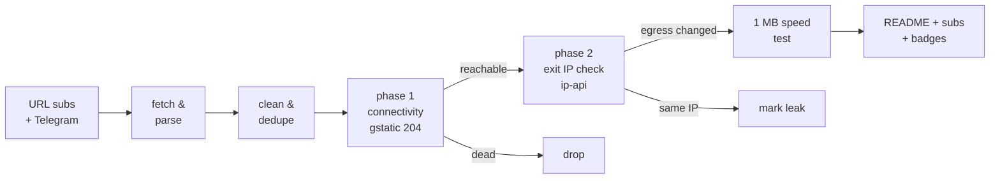

# Free Proxy Scanner

> **Really tested** free proxy aggregator. Every proxy below was fetched from public sources, tunneled through with Xray/sing-box, and verified to actually change your egress IP. No CSV-validation theater, no blind relisting.

      

## What this is

A GitHub Actions pipeline (runs once a day) that fetches free proxy configs from **173 URL subscriptions** and **81 Telegram channels**, parses 9 protocols (vless / vmess / trojan / ss / hysteria2 / hysteria / tuic / socks / http), deduplicates them, and **actually connects through every single one** to separate working proxies from dead ones.

Latest run: **2026-11-17 02:55:04 UTC** — 125704 unique proxies collected from 108/108 URL sources and 9/9 Telegram channels; **4521** endpoints really tested, **1198** reachable, **1174** verified working (egress IP confirmed changed) across **55 exit countries**.

## How the testing works (the *really* part)


```mermaid
flowchart LR
  S1[URL subs<br/>+ Telegram] --> F[fetch &<br/>parse]
  F --> C[clean &<br/>dedupe]
  C --> T1[phase 1<br/>connectivity<br/>gstatic 204]
  T1 -->|reachable| T2[phase 2<br/>exit IP check<br/>ip-api]
  T1 -->|dead| X[drop]
  T2 -->|egress changed| T3[1 MB speed<br/>test]
  T2 -->|same IP| X2[mark leak]
  T3 --> R[README + subs<br/>+ badges]
```

1. **Phase 1 — connectivity.** Each proxy is loaded as an outbound into a real Xray or sing-box instance (or used directly via `curl -x` for plain http/socks). An HTTPS request to `gstatic.com/generate_204` goes through the tunnel with **DNS resolved on the proxy side**. Only an HTTP 204 counts as reachable.
2. **Phase 2 — egress verification.** An ip-api request through the same tunnel must return an exit IP **different from the runner's own IP**, plus its country and AS. Proxies that pass phase 1 but keep your IP are marked as leaks and excluded from the working list. Server country vs exit country mismatches are flagged in the tables.
3. **Throughput.** Working proxies download 1 MB from `speed.cloudflare.com` through the tunnel; the measured rate is the speed you see in the tables.
4. **Engine fallback.** If a proxy fails on Xray, it is retried on sing-box (and vice versa) before being declared dead — some configs only work on one core.

## Top working proxies

All 1174 working proxies are published in [`subs/all.txt`](subs/all.txt); this table shows the top 25.

| # | proxy | proto | server | exit | latency | speed | engine |
|---|-------|-------|--------|------|---------|-------|--------|
| 1 | #1 ❓ ?? → 🇺🇸 US | `trojan` | `66.163.122.7:443` | United States | 156 ms | 83.1 Mbps | xray |
| 2 | #2 ❓ ?? → 🇺🇸 US | `vmess` | `67.220.95.49:1270` | United States | 487 ms | 82.2 Mbps | xray |
| 3 | #3 ❓ ?? → 🇺🇸 US | `trojan` | `66.163.122.113:443` | United States | 171 ms | 73.5 Mbps | xray |
| 4 | #4 ❓ ?? → 🇺🇸 US | `trojan` | `66.163.122.30:443` | United States | 80 ms | 72.2 Mbps | xray |
| 5 | #5 ❓ ?? → 🇺🇸 US | `ss` | `45.86.51.18:19999` | United States | 77 ms | 71.2 Mbps | xray |
| 6 | #6 ❓ ?? → 🇺🇸 US | `vmess` | `38.107.226.5:1270` | United States | 101 ms | 69.8 Mbps | xray |
| 7 | #7 ❓ ?? → 🇺🇸 US | `trojan` | `66.163.122.26:443` | United States | 82 ms | 63.4 Mbps | xray |
| 8 | #8 ❓ ?? → 🇺🇸 US | `trojan` | `66.163.122.46:443` | United States | 77 ms | 61.9 Mbps | xray |
| 9 | #9 ❓ ?? → 🇺🇸 US | `trojan` | `66.163.122.25:443` | United States | 74 ms | 58.0 Mbps | xray |
| 10 | #10 ❓ ?? → 🇺🇸 US | `ss` | `172.111.38.72:19999` | United States | 72 ms | 57.3 Mbps | xray |
| 11 | #11 ❓ ?? → 🇺🇸 US | `vless` | `172.233.201.244:61635` | United States | 66 ms | 55.7 Mbps | xray |
| 12 | #12 ❓ ?? → 🇺🇸 US | `hysteria2` | `206.189.229.48:443` | United States | 68 ms | 52.4 Mbps | singbox |
| 13 | #13 ❓ ?? → 🇺🇸 US | `vmess` | `172.111.38.246:1270` | United States | 153 ms | 50.9 Mbps | xray |
| 14 | #14 🇺🇸 US → 🇦🇺 AU | `vmess` | `67.220.95.3:18000` | Australia | 82 ms | 48.4 Mbps | xray |
| 15 | #15 ❓ ?? → 🇺🇸 US | `vless` | `45.138.100.248:10443` | United States | 59 ms | 46.9 Mbps | singbox |
| 16 | #16 ❓ ?? → 🇺🇸 US | `ss` | `149.40.57.134:19999` | United States | 118 ms | 45.3 Mbps | xray |
| 17 | #17 🇺🇸 US → 🇺🇸 US | `vless` | `169.40.42.229:443` | United States | 255 ms | 43.4 Mbps | xray |
| 18 | #18 ❓ ?? → 🇺🇸 US | `ss` | `138.197.89.234:28960` | United States | 62 ms | 42.7 Mbps | xray |
| 19 | #19 ❓ ?? → 🇺🇸 US | `trojan` | `66.163.122.81:443` | United States | 73 ms | 40.2 Mbps | xray |
| 20 | #20 ❓ ?? → 🇺🇸 US | `ss` | `149.40.57.135:19999` | United States | 63 ms | 40.1 Mbps | xray |
| 21 | #21 ❓ ?? → 🇺🇸 US | `vless` | `45.138.100.248:14430` | United States | 77 ms | 40.1 Mbps | singbox |
| 22 | #22 ❓ ?? → 🇺🇸 US | `ss` | `149.40.57.133:19999` | United States | 63 ms | 39.3 Mbps | xray |
| 23 | #23 ❓ ?? → 🇺🇸 US | `ss` | `193.151.163.18:19999` | United States | 74 ms | 39.1 Mbps | xray |
| 24 | #24 ❓ ?? → 🇨🇦 CA | `ss` | `15.235.121.109:8080` | Canada | 106 ms | 38.2 Mbps | xray |
| 25 | #25 ❓ ?? → 🇺🇸 US | `ss` | `149.40.57.138:19999` | United States | 63 ms | 37.6 Mbps | xray |

## Exit locations — which countries work

Every working proxy, grouped by the country of its **verified exit IP** (phase 2), with a dedicated subscription file per country. Currently 55 countries have at least one working exit.

| country | working | avg speed | best latency | share | list |
|---------|--------:|----------:|-------------:|------:|------|
| 🇺🇸 United States | 332 | 18.3 Mbps | 38 ms | 28% | [`US.txt`](subs/by-country/US.txt) |
| 🇳🇱 Netherlands | 173 | 7.2 Mbps | 279 ms | 15% | [`NL.txt`](subs/by-country/NL.txt) |
| 🇩🇪 Germany | 132 | 6.6 Mbps | 280 ms | 11% | [`DE.txt`](subs/by-country/DE.txt) |
| 🇯🇵 Japan | 86 | 2.4 Mbps | 468 ms | 7% | [`JP.txt`](subs/by-country/JP.txt) |
| 🇨🇦 Canada | 45 | 15.7 Mbps | 83 ms | 4% | [`CA.txt`](subs/by-country/CA.txt) |
| 🇫🇷 France | 37 | 7.8 Mbps | 262 ms | 3% | [`FR.txt`](subs/by-country/FR.txt) |
| 🇸🇬 Singapore | 35 | 3.1 Mbps | 669 ms | 3% | [`SG.txt`](subs/by-country/SG.txt) |
| 🇬🇧 United Kingdom | 32 | 9.0 Mbps | 251 ms | 3% | [`GB.txt`](subs/by-country/GB.txt) |
| 🇪🇸 Spain | 30 | 6.5 Mbps | 295 ms | 3% | [`ES.txt`](subs/by-country/ES.txt) |
| 🇸🇪 Sweden | 23 | 6.1 Mbps | 354 ms | 2% | [`SE.txt`](subs/by-country/SE.txt) |
| 🇫🇮 Finland | 21 | 5.2 Mbps | 382 ms | 2% | [`FI.txt`](subs/by-country/FI.txt) |
| 🇵🇱 Poland | 20 | 6.6 Mbps | 361 ms | 2% | [`PL.txt`](subs/by-country/PL.txt) |
| 🇦🇺 Australia | 18 | 11.8 Mbps | 62 ms | 2% | [`AU.txt`](subs/by-country/AU.txt) |
| 🇮🇹 Italy | 17 | 8.3 Mbps | 335 ms | 1% | [`IT.txt`](subs/by-country/IT.txt) |
| 🇭🇰 Hong Kong | 15 | 2.6 Mbps | 191 ms | 1% | [`HK.txt`](subs/by-country/HK.txt) |
| 🇨🇭 Switzerland | 14 | 8.1 Mbps | 328 ms | 1% | [`CH.txt`](subs/by-country/CH.txt) |
| 🇷🇺 Russia | 10 | 6.4 Mbps | 351 ms | 1% | [`RU.txt`](subs/by-country/RU.txt) |
| 🇧🇾 BY | 9 | 7.0 Mbps | 439 ms | 1% | [`BY.txt`](subs/by-country/BY.txt) |
| 🇹🇷 Turkey | 9 | 4.5 Mbps | 598 ms | 1% | [`TR.txt`](subs/by-country/TR.txt) |
| 🇰🇷 South Korea | 9 | 4.4 Mbps | 780 ms | 1% | [`KR.txt`](subs/by-country/KR.txt) |
| 🇦🇱 AL | 9 | 2.1 Mbps | 520 ms | 1% | [`AL.txt`](subs/by-country/AL.txt) |
| 🇮🇳 India | 9 | 3.0 Mbps | 881 ms | 1% | [`IN.txt`](subs/by-country/IN.txt) |
| 🇪🇪 Estonia | 7 | 5.8 Mbps | 379 ms | 1% | [`EE.txt`](subs/by-country/EE.txt) |
| 🇮🇷 Iran | 7 | 4.9 Mbps | 696 ms | 1% | [`IR.txt`](subs/by-country/IR.txt) |
| 🇷🇴 Romania | 6 | 5.5 Mbps | 607 ms | 1% | [`RO.txt`](subs/by-country/RO.txt) |
| 🇦🇪 UAE | 6 | 2.3 Mbps | 817 ms | 1% | [`AE.txt`](subs/by-country/AE.txt) |
| 🇹🇼 Taiwan | 6 | 2.8 Mbps | 803 ms | 1% | [`TW.txt`](subs/by-country/TW.txt) |
| 🇰🇿 Kazakhstan | 6 | 2.9 Mbps | 1281 ms | 1% | [`KZ.txt`](subs/by-country/KZ.txt) |
| 🇹🇭 Thailand | 6 | 1.9 Mbps | 1046 ms | 1% | [`TH.txt`](subs/by-country/TH.txt) |
| 🇳🇬 NG | 5 | 4.0 Mbps | 1280 ms | 0% | [`NG.txt`](subs/by-country/NG.txt) |
| 🇨🇿 Czechia | 4 | 6.3 Mbps | 446 ms | 0% | [`CZ.txt`](subs/by-country/CZ.txt) |
| 🇿🇦 South Africa | 4 | 4.2 Mbps | 816 ms | 0% | [`ZA.txt`](subs/by-country/ZA.txt) |
| 🇦🇹 Austria | 3 | 8.0 Mbps | 359 ms | 0% | [`AT.txt`](subs/by-country/AT.txt) |
| 🇧🇷 Brazil | 3 | 7.0 Mbps | 510 ms | 0% | [`BR.txt`](subs/by-country/BR.txt) |
| 🇳🇴 Norway | 2 | 7.2 Mbps | 484 ms | 0% | [`NO.txt`](subs/by-country/NO.txt) |
| 🇱🇻 Latvia | 2 | 6.7 Mbps | 571 ms | 0% | [`LV.txt`](subs/by-country/LV.txt) |
| 🇨🇾 Cyprus | 2 | 6.1 Mbps | 578 ms | 0% | [`CY.txt`](subs/by-country/CY.txt) |
| 🇲🇾 Malaysia | 2 | 3.5 Mbps | 911 ms | 0% | [`MY.txt`](subs/by-country/MY.txt) |
| 🇻🇳 Vietnam | 2 | 3.3 Mbps | 1090 ms | 0% | [`VN.txt`](subs/by-country/VN.txt) |
| 🇵🇹 Portugal | 1 | 9.2 Mbps | 440 ms | 0% | [`PT.txt`](subs/by-country/PT.txt) |
| 🇩🇰 Denmark | 1 | 8.0 Mbps | 465 ms | 0% | [`DK.txt`](subs/by-country/DK.txt) |
| 🇱🇹 Lithuania | 1 | 7.8 Mbps | 565 ms | 0% | [`LT.txt`](subs/by-country/LT.txt) |
| 🇨🇱 Chile | 1 | 7.3 Mbps | 457 ms | 0% | [`CL.txt`](subs/by-country/CL.txt) |
| 🇮🇪 Ireland | 1 | 6.3 Mbps | 225 ms | 0% | [`IE.txt`](subs/by-country/IE.txt) |
| 🇲🇽 Mexico | 1 | 5.3 Mbps | 242 ms | 0% | [`MX.txt`](subs/by-country/MX.txt) |
| 🇺🇦 Ukraine | 1 | 5.1 Mbps | 3310 ms | 0% | [`UA.txt`](subs/by-country/UA.txt) |
| 🇬🇪 Georgia | 1 | 4.9 Mbps | 802 ms | 0% | [`GE.txt`](subs/by-country/GE.txt) |
| 🇸🇦 Saudi Arabia | 1 | 4.8 Mbps | 975 ms | 0% | [`SA.txt`](subs/by-country/SA.txt) |
| 🇦🇷 Argentina | 1 | 4.5 Mbps | 715 ms | 0% | [`AR.txt`](subs/by-country/AR.txt) |
| 🇬🇷 Greece | 1 | 4.1 Mbps | 4300 ms | 0% | [`GR.txt`](subs/by-country/GR.txt) |
| 🇦🇲 Armenia | 1 | 3.2 Mbps | 1200 ms | 0% | [`AM.txt`](subs/by-country/AM.txt) |
| 🇧🇬 Bulgaria | 1 | 2.6 Mbps | 571 ms | 0% | [`BG.txt`](subs/by-country/BG.txt) |
| 🇵🇭 Philippines | 1 | 2.0 Mbps | 1048 ms | 0% | [`PH.txt`](subs/by-country/PH.txt) |
| 🇷🇸 Serbia | 1 | 0.9 Mbps | 1607 ms | 0% | [`RS.txt`](subs/by-country/RS.txt) |
| 🇸🇨 SC | 1 | - | 8707 ms | 0% | [`SC.txt`](subs/by-country/SC.txt) |

A `??` exit means the geo lookup could not resolve the exit IP. Base64 variants of every country file sit next to them as `<CC>.base64.txt`.

## Protocol distribution

| protocol | tested | alive | working | alive rate |
|----------|-------:|------:|--------:|-----------:|
| `vless` | 2811 | 638 | 619 | 23% |
| `ss` | 558 | 251 | 247 | 45% |
| `vmess` | 936 | 154 | 154 | 16% |
| `trojan` | 155 | 118 | 117 | 76% |
| `hysteria2` | 57 | 35 | 35 | 61% |
| `socks` | 2 | 2 | 2 | 100% |
| `http` | 2 | 0 | 0 | 0% |

Per-protocol working lists: [`subs/by-proto/`](subs/by-proto/) (one `vless.txt`, `vmess.txt`, ... per protocol, plus `.base64.txt` variants).

## Engine breakdown

Which core verified each working proxy. The engine fallback means a proxy that failed on its primary core got a second chance on the other one.

| engine | working | note |
|--------|--------:|------|
| Xray-core | 1047 | [`allxray.txt`](subs/by-engine/allxray.txt) |
| sing-box | 125 | [`allsingbox.txt`](subs/by-engine/allsingbox.txt) |
| direct (curl) | 2 | plain http/socks, [`alldirect.txt`](subs/by-engine/alldirect.txt) |

## Speed & latency profile

| speed tier | proxies |
|-----------|--------:|
| >= 5 Mbps | 712 |
| 1 - 5 Mbps | 295 |
| 0.25 - 1 Mbps | 46 |
| < 0.25 Mbps | 0 |
| unmeasured | 121 |

Latency (phase-1 HTTPS round trip): median **460 ms**, p90 **2649 ms**. 24 proxies passed connectivity but failed egress verification (leaked the runner IP or broke on the exit check) and are excluded.

## Source health

117 active, 137 auto-retired (10 fetch failures / 10 all-dead runs / 10 days without anything new). Best contributors this run:

| source | kind | tested | alive | new this run |
|--------|------|-------:|------:|-------------:|
| `SK` | url | 1067 | 696 | 6951 |
| `NK` | url | 1014 | 644 | 0 |
| `EV` | url | 691 | 601 | 1084 |
| `HP` | url | 525 | 482 | 118 |
| `RD-VL` | url | 2369 | 397 | 3523 |
| `HC` | url | 1347 | 376 | 121 |
| `AG-PL` | url | 516 | 363 | 748 |
| `EV-VL` | url | 386 | 309 | 0 |
| `Ni` | url | 341 | 265 | 71 |
| `RD-SS` | url | 491 | 245 | 397 |
| `KA` | url | 2923 | 242 | 6793 |
| `F0` | url | 240 | 233 | 0 |
| `EV-SS` | url | 230 | 222 | 106 |
| `ST-VL` | url | 2120 | 199 | 560 |
| `ET` | url | 249 | 159 | 806 |
| `RD-VM` | url | 582 | 140 | 3850 |
| `SB` | url | 2039 | 137 | 196 |
| `LA` | url | 716 | 130 | 14560 |
| `ST-VM` | url | 577 | 122 | 32 |
| `SB-VL` | url | 1879 | 100 | 0 |

## History

working per run (last 29): ▁▁▆▆▆▇▆▆▆█▇▆▆▆▆▆█▆▆▇█████████

| date (UTC) | tested | alive | working | avg | max |
|------------|-------:|------:|--------:|----:|----:|
| 2026-11-17 03:38 | 4521 | 1198 | 1174 | 10.0M | 83.1M |
| 2026-11-16 03:41 | 4523 | 1137 | 1100 | 10.3M | 83.4M |
| 2026-11-14 03:41 | 4514 | 1104 | 1067 | 10.7M | 135.5M |
| 2026-11-13 03:31 | 4507 | 1150 | 1119 | 9.4M | 56.3M |
| 2026-11-12 03:35 | 4512 | 1209 | 1166 | 7.0M | 73.5M |
| 2026-11-11 03:35 | 4521 | 1141 | 1102 | 10.1M | 108.1M |
| 2026-11-10 03:31 | 4511 | 1098 | 1052 | 8.2M | 76.8M |
| 2026-11-09 03:34 | 4509 | 1081 | 1046 | 7.6M | 96.5M |
| 2026-11-08 03:39 | 4502 | 1098 | 1068 | 7.7M | 107.7M |
| 2026-11-07 03:34 | 4503 | 1040 | 994 | 7.6M | 82.2M |
| 2026-11-06 10:53 | 4846 | 900 | 837 | 8.5M | 49.1M |
| 2026-10-03 11:04 | 4500 | 899 | 860 | 8.7M | 82.3M |
| 2026-10-03 02:52 | 4500 | 1062 | 1030 | 8.0M | 75.5M |
| 2026-10-02 21:49 | 4500 | 890 | 861 | 8.9M | 68.7M |
| 2026-10-02 17:14 | 4500 | 847 | 807 | 8.6M | 88.1M |

## Subscription files

Everything under [`subs/`](subs/) is regenerated every run. Plain lists are one proxy URI per line; `.base64.txt` variants are the same list base64-encoded for clients that need the classic sub format.

| file | contents | direct subscription URL |
|------|----------|--------------------------|
| [`all.txt`](subs/all.txt) | ALL working proxies, ranked by speed (1174) | `https://raw.githubusercontent.com/onlyactions/proxy-scanner/main/subs/all.txt` |
| [`all.base64.txt`](subs/all.base64.txt) | same, base64 | `https://raw.githubusercontent.com/onlyactions/proxy-scanner/main/subs/all.base64.txt` |
| [`top150.txt`](subs/top150.txt) | top 150 ranked (150) | `https://raw.githubusercontent.com/onlyactions/proxy-scanner/main/subs/top150.txt` |
| [`top150.base64.txt`](subs/top150.base64.txt) | same, base64 | `https://raw.githubusercontent.com/onlyactions/proxy-scanner/main/subs/top150.base64.txt` |
| [`by-proto/`](subs/by-proto/) | one list per protocol (6 protocols) | ...`/subs/by-proto/<proto>.txt` |
| [`by-engine/allxray.txt`](subs/by-engine/allxray.txt) | verified on Xray (1047) | `https://raw.githubusercontent.com/onlyactions/proxy-scanner/main/subs/by-engine/allxray.txt` |
| [`by-engine/allsingbox.txt`](subs/by-engine/allsingbox.txt) | verified on sing-box (125) | `https://raw.githubusercontent.com/onlyactions/proxy-scanner/main/subs/by-engine/allsingbox.txt` |
| [`by-country/`](subs/by-country/) | one list per exit country (55 countries, e.g. [`US.txt`](subs/by-country/US.txt), [`DE.txt`](subs/by-country/DE.txt)) | ...`/subs/by-country/<CC>.txt` |
| [`sing-box-client.json`](subs/sing-box-client.json) | top 150 as a ready-to-run sing-box client config | `https://raw.githubusercontent.com/onlyactions/proxy-scanner/main/subs/sing-box-client.json` |
| [`xray-client.json`](subs/xray-client.json) | top 150 as a ready-to-run xray client config | `https://raw.githubusercontent.com/onlyactions/proxy-scanner/main/subs/xray-client.json` |
| [`archive/`](archive/) | gz snapshot of every collection (30 kept) | — |

## Use the proxies

- **v2rayN / v2rayNG / Nekobox / Hiddify / Shadowrocket**: add subscription `https://raw.githubusercontent.com/onlyactions/proxy-scanner/main/subs/all.base64.txt` (everything working) or `https://raw.githubusercontent.com/onlyactions/proxy-scanner/main/subs/top150.base64.txt` (curated top 150).
- **Want a specific country?** Grab `subs/by-country/<CC>.txt` (see the Exit locations table above) — e.g. `https://raw.githubusercontent.com/onlyactions/proxy-scanner/main/subs/by-country/US.txt`, `https://raw.githubusercontent.com/onlyactions/proxy-scanner/main/subs/by-country/DE.txt`.
- **Only one protocol?** `subs/by-proto/<proto>.txt` — e.g. `https://raw.githubusercontent.com/onlyactions/proxy-scanner/main/subs/by-proto/vless.txt`, `https://raw.githubusercontent.com/onlyactions/proxy-scanner/main/subs/by-proto/hysteria2.txt`.
- **sing-box**: download [`subs/sing-box-client.json`](subs/sing-box-client.json) and run `sing-box run -c sing-box-client.json` — it listens on `127.0.0.1:2080` (mixed) with a selector + auto urltest group.
- **Xray**: download [`subs/xray-client.json`](subs/xray-client.json), socks inbound on `127.0.0.1:2080`.
- Raw snapshots of every collection: [`archive/`](archive/) (30 kept).

## Repository layout

```
sources/            url_subs.yml + telegram.yml (scannable source lists)
scripts/            collect.py, test.py, report.py + lib/
state/              source health, alive-recall pool, geo cache (committed)
data/               stats, history, compact last-run results
subs/               THE PRODUCT: verified working proxies, split by
                    proto / engine / exit country + all + top150 lists
badges/             shields.io endpoint badges
archive/            gz snapshots of every collection
```

## Why most "free proxy lists" lie

The typical aggregator relists whatever it scraped, so 80-95% of entries are dead within hours — this run found **74% unreachable** and **74% unusable** overall. Only tunnels that completed a real HTTPS handshake, returned a verifiable foreign exit IP, and pushed a 1 MB download are counted as working here.

## Disclaimers

- Free proxies are **public and untrusted**. Anything you send through them can be observed or modified by their operators. Never use them for authentication, payments, or anything sensitive.
- All configs are collected from publicly posted sources (GitHub subscriptions and public Telegram channels); no credentials are guessed or brute-forced. Removal requests: open an issue.
- Availability is transient: the working list is re-verified daily, and past performance never guarantees future availability.

